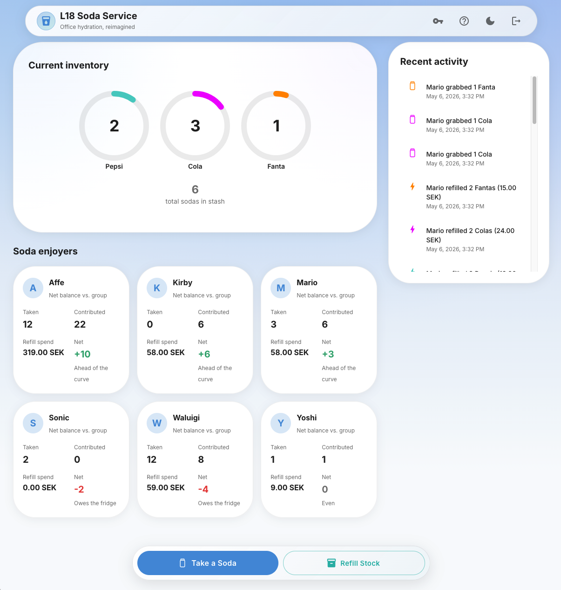
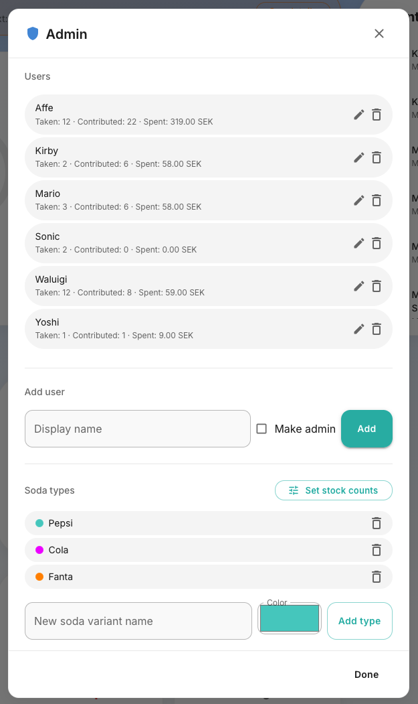
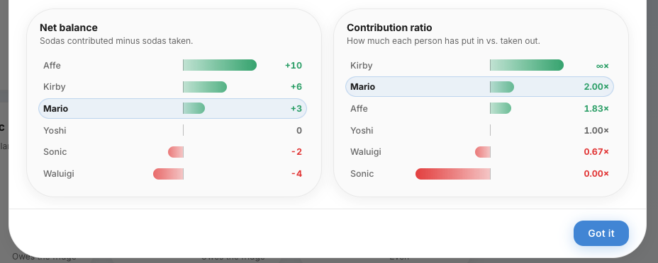
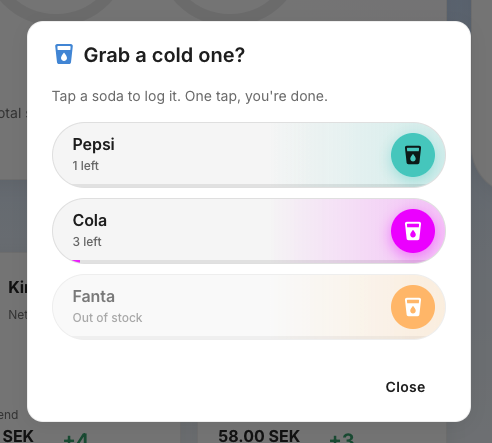
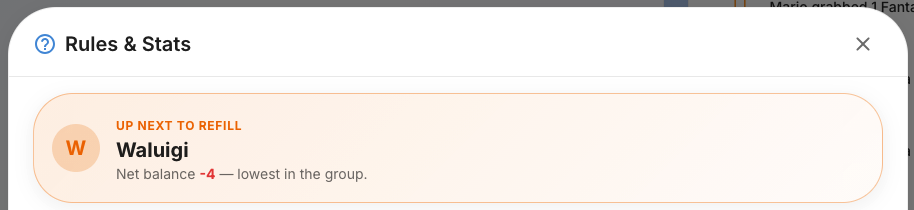

# Soda-management
A system for managing and running a community driven soda service. Includes admin convenience features like inventory management, account creation and state management that are hidden from normal users. 

Overview the stash, log your usage, and get reminded when it is your time to refill! 🍹

### 🎯Project milestones:

1. Dockerized Spring boot Backend Application ✅
2. Frontend Application with full mobile support ✅
3. Docker config for an easily deployable image of backend ✅
4. Github Actions workflows to build, tag and push docker images to dockerhub ✅
5. Protected Admin page for state and account management ✅
6. Support for IOS "Add to homescreen" app bookmark ✅

## 📸 Screenshots

<table>
  <tr>
    <td></td>
    <td></td>
  </tr>
</table>

<table> 
  <tr>
    <td></td>
    <td></td>
  </tr>
</table>

<table>
  <tr>
    <td></td>
  </tr>
</table>
